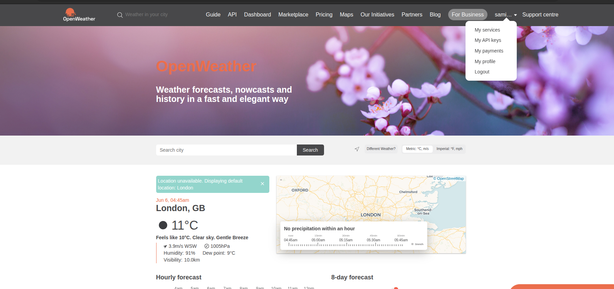
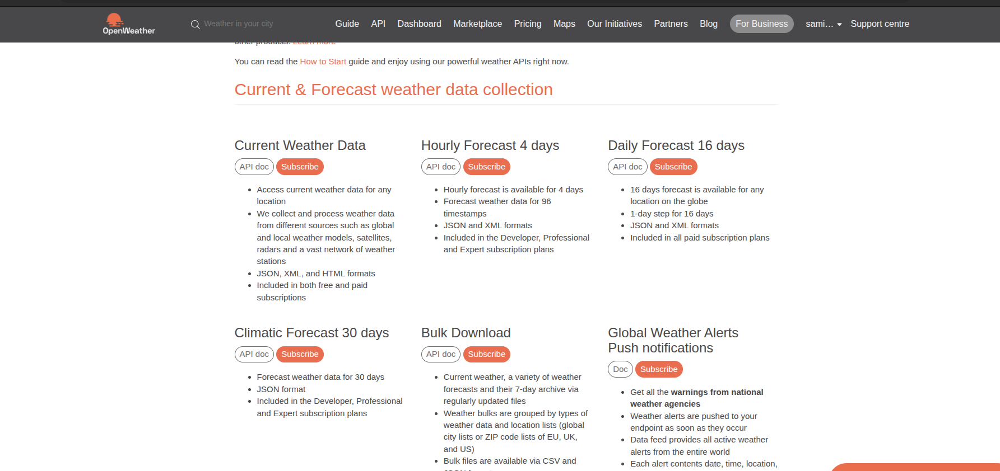
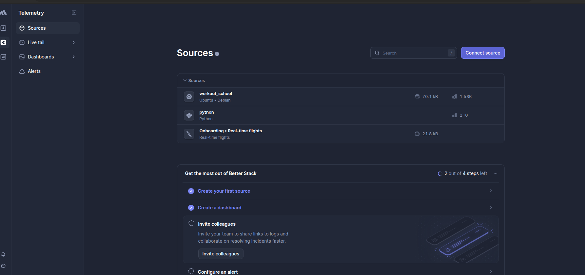

- Install all the requrirement from requirements.txt
# what more we need:

- WEATHER_API_KEY ->to featch the data of weather , i have used OpenWeather to featch current weather data
- first we have to signup in https://openweathermap.org and then we have to create our API_key  -> here we can see my api key we can create api key form here.

- Then in the API section in the menu bar we have Api doc for each typ of services  we can use then as our requirement , i have used current weather data 

- To send the logs to the cloud i have  used BetterStack(https://betterstack.com/) so we have to make account there and make a source
-  ->click on create source and we can create a source of our disear name ,
- there we can find SOURCE_TOKEN and INGESTING_HOST  we need this two to send logs to this platform